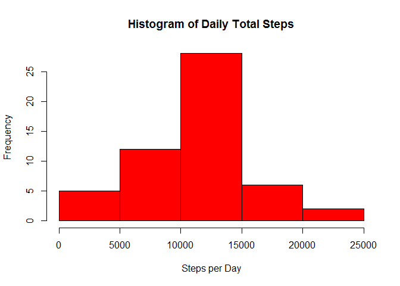
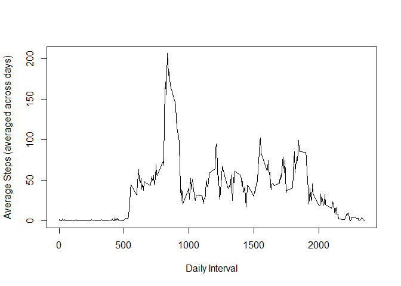
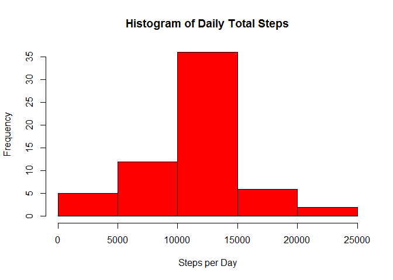
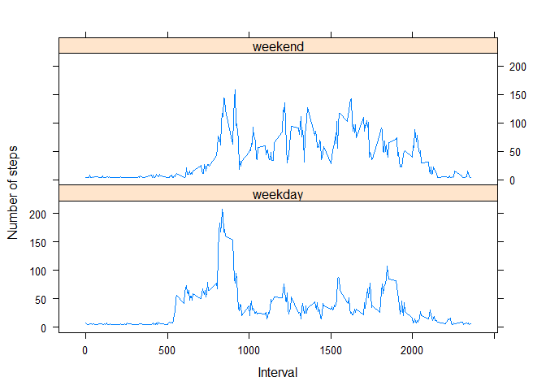

# Reproducible Research: Peer Assessment 1

## Loading and preprocessing the data
The dataset for this analysis is held in the "activity.zip" file in the top level of the Github repository. The following code reads the data from the ".csv" file inside of the ".zip" file and saves it to a data frame called ```rawData```. The format of the columns is set within this code, formatting the columns as follows:

|Column|Format|
|-----:|:-----|
|steps|numeric|
|date|date formatted as YYYY-MM-DD|
|interval|numeric|


```r
rawData <- read.csv(unz("./activity.zip", "activity.csv"), colClasses=c(
  as.numeric(), as.Date(character(), format = "%Y-%m-%d"), as.numeric()),
  header=TRUE, stringsAsFactors = FALSE)
```


## What is mean total number of steps taken per day?
First we will plot the data in a histogram, showing the frequency vs. total number of steps per day.

Since the raw data is measured as number of steps per 5-minute interval within a day, we need to transform the data to get a single number of steps per day. We will do this by summing the steps of all of the 5-minute intervals throughout each day to get the daily sum.

We will save the steps per day data into a new variable to preserve the ```rawData``` variable that we originally loaded the data in.

First we need to identify what days are covered in the ```rawData``` data frame. We do this by removing duplicates from the ```date``` column in the ```rawData``` data frame and saving that list as a new variable, ```dayDuplicates```. This will give us a vector with a listing off all of the dates in the ```rawData``` data frame.


```r
dayDuplicates <- rawData$date[!duplicated(rawData$date)]
```

Next, we will use this ```dayDuplicates``` vector to create a ```for``` loop, so that we can loop over each day individually in the ```rawData``` dataset. Within this ```for``` loop, we will select a single day from the ```rawData``` data frame and sum all of the intervals to find the total sum of steps over that day.


```r
# Create data frame to store "for"" loop result
dailyStepSum <- data.frame(Date = c(1:length(dayDuplicates)), Steps = c(1:length(dayDuplicates)))

# Loop through "rawData" data frame, summing steps over each day
for(i in 1:length(dayDuplicates)){
  selectedDate <- dayDuplicates[i]
  stepSum <- sum(rawData$steps[rawData$date == selectedDate])
  
  # Save summed steps to new data frame
  dailyStepSum$date[i] <- selectedDate
  dailyStepSum$steps[i] <- stepSum
}
```

Using this new data frame ```dailyStepSum```, we can:

1) plot the data in a histogram


```r
hist(dailyStepSum$steps, main = "Histogram of Daily Total Steps", xlab = "Steps per Day", col = "red")
```

 

2) find values for the median and mean of the data.


```r
dailyStepMean <- mean(dailyStepSum$steps, na.rm = TRUE)
dailyStepMedian <- median(dailyStepSum$steps, na.rm = TRUE)
```

Mean:

```
## [1] 10766.19
```
Median:

```
## [1] 10765
```

## What is the average daily activity pattern?
Next, we will check out the daily activity pattern by plotting the average steps taken per 5 minute interval each day.

We will first need to create a new vector ```intervalDuplicates``` listing all of the intervals per day so that we can loop over this vector.


```r
intervalDuplicates <- rawData$interval[!duplicated(rawData$interval)]
```

Next we will initialize the new data frame which will hold a column of the intervals in each day and a column with the average steps that are taken during that interval, averaged across all days.


```r
# Create data frame to store "for"" loop result
typicalStepAvg <- data.frame(Interval = c(1:length(intervalDuplicates)), Steps = c(1:length(intervalDuplicates)))

# Loop through "rawData" data frame, averaging steps over each interval
# across all of the days
for(i in 1:length(intervalDuplicates)){
  selectedInterval <- intervalDuplicates[i]
  typStepAvg <- mean(rawData$steps[rawData$interval == selectedInterval],
                     na.rm = TRUE)

  # Save average steps and interval to data frame
  typicalStepAvg$Interval[i] <- selectedInterval
  typicalStepAvg$Steps[i] <- typStepAvg
}
```

Using this new data frame ```dailyStepSum```, we can:

1) Plot the data in a time series plot.


```r
plot(typicalStepAvg$Interval, typicalStepAvg$Steps, type = "l", xlab = "Daily Interval", ylab = "Average Steps (averaged across days)")
```

 

2) Determine which interval has the maximum average steps per day by first determining what that max value is and then finding out which interval holds that value in the data frame.

Maximum number of steps (average):

```r
intervalMax <- max(typicalStepAvg$Steps, na.rm = TRUE)
print(intervalMax)
```

```
## [1] 206.1698
```

Interval:

```r
typicalStepAvg$Interval[typicalStepAvg$Steps == intervalMax]
```

```
## [1] 835
```

## Imputing missing values
1) There is missing data in the dataset, so we should determine how many missing values we have in the dataset.


```r
sum(is.na(rawData$steps))
```

```
## [1] 2304
```

2) We can fill in the data that is missing in each interval in each day with the average number of steps over all of the intervals of all of the days.

3) In order to fill in the missing data, we first need to create a new data frame, ```filledData```, with the raw data that we can manipulate without affecting the original raw data.


```r
filledData <- rawData
```

Next, we need to find the average number of steps averaged over all of the intervals in the ```rawData``` data frame. Then we save this average into the rows in the ```filledData``` data frame in the ```steps``` column where the data is missing from that column.


```r
filledData$steps[is.na(filledData$steps) == TRUE] <- mean(rawData$steps,
                                                          na.rm = TRUE)
```

When this is complete, we get a data frame with no missing values:


```r
colSums(is.na(filledData))
```

```
##    steps     date interval 
##        0        0        0
```

4) We can now perform the same calculation over this data that we did at the beginning of this analysis, this time using the data frame with no missing values.

First, we use the ```dayDuplicates``` vector to create a ```for``` loop, so that we can loop over each day individually in the ```filledData``` dataset. Within this ```for``` loop, we will select a single day from the ```filledData``` data frame and sum all of the intervals to find the total sum of steps over that day.


```r
# Create data frame to store "for"" loop result
filledDailyStepSum <- data.frame(Date = c(1:length(dayDuplicates)),
                                 Steps = c(1:length(dayDuplicates)))

# Loop through "rawData" data frame, summing steps over each day
for(i in 1:length(dayDuplicates)){
  selectedDate <- dayDuplicates[i]
  stepSum <- sum(filledData$steps[filledData$date == selectedDate])
  
  # Save summed steps to new data frame
  filledDailyStepSum$date[i] <- selectedDate
  filledDailyStepSum$steps[i] <- stepSum
}
```

Using this new data frame ```filledDailyStepSum```, we can:

* plot the data in a histogram


```r
hist(filledDailyStepSum$steps, main = "Histogram of Daily Total Steps", xlab = "Steps per Day", col = "red")
```

 

* find values for the median and mean of the data.


```r
filledDailyStepMean <- mean(filledDailyStepSum$steps, na.rm = TRUE)
filledDailyStepMedian <- median(filledDailyStepSum$steps, na.rm = TRUE)
```

Mean:

```
## [1] 10766.19
```
Median:

```
## [1] 10766.19
```

Do these values differ from the estimates from the first part of the assignment?

Yes, imputing values did make a difference in the histogram and median value for the data. 

What is the impact of imputing missing data on the estimates of the total daily number of steps?

Since the average value of the steps was chosen to fill in the data, we see: 1) The average of all the data that stayed the same, 2) The median value became the same as the average value, which was originally very close but not exactly the same, 3) The histogram changed only in that the values at the center increased in frequency, since it was the average value which was added to the missing values.

## Are there differences in activity patterns between weekdays and weekends?

1) To determine if there are activity patterns based on weekends and weekdays, first we need to create a new column in the ```filledData``` dataset. We do this by converting the ```date``` column of the ```filledData``` data frame into a POSIX date object.

Next we loop over the ```date``` column and, using the ```weekdays``` function, we evaluate whether the selected date is a weekday and then add a new column with the result.


```r
# Convert "date"" column to POSIX
filledData$date <- as.POSIXct(filledData$date, format = "%Y-%m-%d")

# Loop over "filledData" to add a "weekday" column
for(i in 1:length(filledData$date)){
  if(weekdays(filledData$date[i]) == "Monday" |
     weekdays(filledData$date[i]) == "Tuesday" |
     weekdays(filledData$date[i]) == "Wednesday" |
     weekdays(filledData$date[i]) == "Thursday" |
     weekdays(filledData$date[i]) == "Friday"){
    filledData$weekday[i] <- "weekday"
  } else {
    filledData$weekday[i] <- "weekend"
  }
}

# Convert the "weekday" column to a factor
filledData$weekday <- as.factor(filledData$weekday)
str(filledData)
```

```
## 'data.frame':	17568 obs. of  4 variables:
##  $ steps   : num  37.4 37.4 37.4 37.4 37.4 ...
##  $ date    : POSIXct, format: "2012-10-01" "2012-10-01" ...
##  $ interval: int  0 5 10 15 20 25 30 35 40 45 ...
##  $ weekday : Factor w/ 2 levels "weekday","weekend": 1 1 1 1 1 1 1 1 1 1 ...
```

2) If we want to graph the data in this new data frame based off of the average steps in the week days and weekends, we first need to create a new data frame with these daily averages. We do this by first creating looping vectors and then constructing a nested loop with the vectors.

We will be looping over the day of week factors and then the ```interval``` column in the data frame to get two sets of intervals, one for the weekdays and one for the weekends.

Inside the ```interval``` vector loop, we will find the mean value of the ```steps``` column over each ```interval``` for each day of the week, i.e. weekday vs. weekend.


```r
# Create vectors to use as looping vectors
intervalDuplicates <- filledData$interval[!duplicated(filledData$interval)]
weekdayDuplicates <- as.character(filledData$weekday[!duplicated(filledData$weekday)])

# Create data frame to save interval averages based on day of the week
dayofweekStepAvg <- data.frame(Interval = as.integer(rep(intervalDuplicates, 2)),
                               Steps = integer(length(intervalDuplicates)*2),
                               DayofWeek = character(length(intervalDuplicates)*2),
                               stringsAsFactors = FALSE)

# Set a looping variable so that we don't overwrite the first loop
x <- 0

# Loop over each weekday first
for(i in 1:length(weekdayDuplicates)){
  
  # Loop over each interval for each weekday
  for(j in 1:length(intervalDuplicates)){
    
    # Save the day of the week we are looping over to the "DayofWeek" column
    dayofweekStepAvg$DayofWeek[x + j] <- weekdayDuplicates[i]
    
    # Save the mean of the steps that match the current interval in the loop
    # and the current day of week
    dayofweekStepAvg$Steps[x + j] <- mean(filledData$steps[
      filledData$interval == intervalDuplicates[j] &
        filledData$weekday == weekdayDuplicates[i]], na.rm = TRUE)
  }
  
  # Add the length of the loop to the looping variable to start the loop from
  # the beginning of the next sectio
  x <- x + length(intervalDuplicates)
}
```

Now that we have the data saved, we can look at it in a plot.


```r
library(lattice)
xyplot(dayofweekStepAvg$Steps ~ dayofweekStepAvg$Interval |
         dayofweekStepAvg$DayofWeek, layout = c(1,2), type="l",
       xlab = "Interval", ylab = "Number of steps")
```

 
